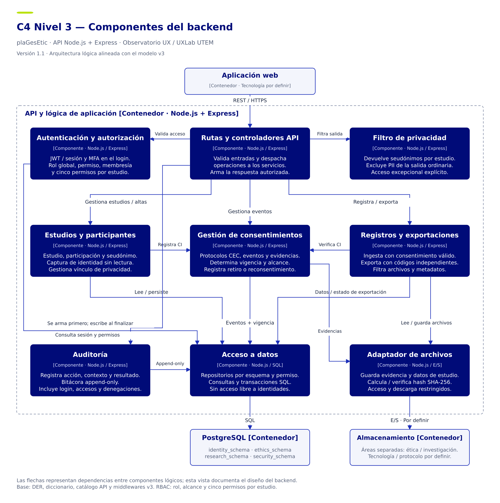

# Especificación Técnica — plaGesEtic

**Versión:** 1.0  
**Estado:** Consolidada para revisión mediante Pull Request  
**Responsable de documentación:** Catalina Araniz  
**Proyecto:** plaGesEtic · Observatorio UX / UXLab UTEM

## 1. Objetivo

Consolidar la especificación técnica del MVP: arquitectura, modelo de datos, API, seguridad, privacidad, consentimientos y diagramas. El documento describe el diseño y sus decisiones pendientes; la ejecución funcional se registra por separado.

La base técnica comprende el DER y diccionario v3, catálogo de endpoints y middlewares v3, matriz de seudonimización v3 y flujo de consentimientos v2. Esta versión sigue las once secciones de la plantilla del repositorio.

## 2. Alcance

El MVP considera la gestión de estudios, participantes, consentimientos y asentimientos, archivos de investigación, exportaciones desidentificadas, seis roles, autenticación MFA y auditoría. Las definiciones que requieren concreción en implementación se registran en la sección 9.

## 3. Arquitectura del sistema

### 3.1 Descripción general

La arquitectura cliente-servidor separa la aplicación web, API, PostgreSQL y almacenamiento. El backend concentra las reglas de permisos, elegibilidad ética, protección de identidad y trazabilidad.

| Elemento | Definición |
| --- | --- |
| API | Node.js y Express; operaciones JSON, cargas multipart y descargas en stream. Sin prefijo `/api/v1` (ADR-002, D2). |
| Persistencia | PostgreSQL con 22 tablas distribuidas en cuatro esquemas. |
| Aplicación y archivos | Docker según ADR-001; aplicación web, API, base de datos y almacenamiento como contenedores lógicos. Frontend en HTML, CSS y JavaScript sin framework (ADR-002, D6); tecnología del almacenamiento por definir. |
| Almacenamiento | Áreas independientes para documentos éticos y archivos de investigación, con permisos y rutas propios. |

### 3.2 Contexto del sistema

Los usuarios operan mediante la aplicación web según su rol: Director, Investigador, Asistente, Soporte, Estudiante o Invitado. La API aplica las restricciones antes de acceder a datos y archivos. La aprobación del CEC condiciona los protocolos y el tratamiento excepcional de archivos sensibles; no se presupone una integración externa automatizada con el CEC.

### 3.3 Componentes principales

Los componentes lógicos del backend abarcan autenticación y recuperación, autorización RBAC, estudios y membresías, identidad y representación, consentimientos, archivos, exportaciones, filtrado de respuestas y auditoría. PostgreSQL mantiene cuatro esquemas; las evidencias éticas y archivos de investigación permanecen en áreas independientes.

### 3.4 Comunicación entre componentes

Auditoría se prepara primero; autenticación verifica JWT, sesión vigente y cuenta activa; RBAC evalúa permiso del rol, alcance y membresía o autorización; el controlador ejecuta la operación; seudonimización filtra la respuesta; auditoría inserta el resultado al finalizar. Los intentos 401 y 403 y los login públicos también se registran.

La membresía diferencia puede_consultar, puede_cargar, puede_modificar, puede_descargar y puede_exportar, con vigencia. Un permiso global puede permitir supervisión sin membresía. Las autorizaciones especiales requieren estado aprobado, recurso y estudio correspondientes y fecha de vencimiento futura.

## 4. Modelo de datos

### 4.1 Descripción general

El DER y diccionario v3 definen 22 tablas repartidas en cuatro esquemas. La identidad y su vínculo con la investigación permanecen separados de los datos de estudio y de los mecanismos de acceso.

### 4.2 Entidades principales

| Esquema | Responsabilidad y tablas |
| --- | --- |
| identity_schema | Identidad cifrada, UX Lab ID, vínculo 1 a 1 y representación legal entre identidades. 3 tablas. |
| ethics_schema | Versiones de protocolo y aprobación CEC, documentos, consentimiento y eventos con evidencia. 4 tablas. |
| research_schema | Estudios, participantes, participaciones, sesiones de investigación, archivos y exportaciones con su mapeo interno. 7 tablas. |
| security_schema | Usuarios, roles, permisos, membresías, sesiones de login, códigos MFA, autorizaciones y auditoría. 8 tablas. |

### 4.3 Relaciones

La identidad y el participante se relacionan mediante un vínculo de uno a uno. Un participante puede incorporarse a varios estudios mediante participaciones, con una combinación única de participante y estudio. La representación legal relaciona las identidades del representante y representado.

El consentimiento corresponde a una participación y tipo de decisión; sus eventos referencian el documento versionado y, cuando corresponde, la representación. Los archivos se vinculan a sesiones de investigación. Cada exportación conserva un mapeo interno entre paquete y participaciones.

UX Lab ID identifica internamente a la persona; codigo_seudonimo identifica su participación en un estudio. codigo_exportacion identifica el paquete y codigo_en_exportacion identifica a la participación dentro de ese paquete. Los cuatro códigos son aleatorios e independientes.

## 5. API y endpoints

### 5.1 Descripción de la API

La API usa Node.js y Express, operaciones JSON, cargas multipart y descargas en stream. Las rutas no llevan prefijo `/api/v1` (ADR-002, D2). Los controles combinan rol, alcance, permisos por estudio, responsabilidad y autorizaciones específicas.

### 5.2 Endpoints

El catálogo v3 contiene 60 endpoints en 11 grupos. El anexo Markdown conserva método, recurso, roles, permiso por estudio, entrada y salida de todas las rutas. La tabla permiso es la fuente del RBAC; las restricciones por responsable, recurso y autorizaciones siguen siendo condiciones adicionales.

| Grupo de recursos | Rutas |
| --- | --- |
| Autenticación y MFA | 6 |
| Usuarios sesiones y permisos | 10 |
| Estudios protocolos y CEC | 9 |
| Membresías | 4 |
| Identidades y representación | 5 |
| Participaciones y sesiones de investigación | 6 |
| Consentimientos y asentimientos | 7 |
| Archivos de investigación | 4 |
| Exportaciones | 4 |
| Autorizaciones especiales | 3 |
| Auditoría y plantillas | 2 |
| Total | 60 |

El detalle completo se conserva en el [Catálogo API integrado v1.0](Catalogo_API_Integrado_v1_0_plaGesEtic.md), que acompaña esta especificación.

## 6. Seguridad y privacidad

### 6.1 Autenticación

Los seis roles ingresan con correo, contraseña y segundo factor TOTP o código de recuperación de un solo uso. El QR configura la aplicación de autenticación. El modelo usa hash argon2id, secreto TOTP cifrado y hash del token de sesión. Soporte recupera cuentas con contraseña temporal y puede reiniciar MFA; el usuario debe cambiar la contraseña y enrolar MFA nuevamente cuando corresponda.

El contrato para primer ingreso, cambio de contraseña y enrolamiento MFA con una sesión restringida queda por precisar.

**Estado al 10/10:** diseño definido; el ingreso con contraseña y TOTP se implementa en el prototipo Alfa (11/10). Enrolamiento con QR, códigos de recuperación y recuperación de contraseña quedan para la Actividad 74 (ADR-002, D3). En el Alfa la sesión viaja como `Authorization: Bearer`; la cookie HttpOnly se adopta con el frontend (ADR-002, D4).

### 6.2 Autorización y roles

Los seis roles son Director, Investigador, Asistente, Soporte, Estudiante e Invitado. El acceso combina el permiso del rol y su alcance con la membresía vigente o una autorización especial aplicable; no se deriva únicamente del nombre del rol.

La membresía diferencia `puede_consultar`, `puede_cargar`, `puede_modificar`, `puede_descargar` y `puede_exportar`. Las autorizaciones especiales requieren aprobación, recurso y estudio correspondientes y vencimiento futuro. La matriz y los paneles esperados se documentan en el [informe de autenticación y roles](../autenticacion/Documentacion_Autenticacion_Roles_plaGesEtic.md).

### 6.3 Auditoría

La auditoría se prepara antes de autenticar y registra el resultado al finalizar, incluidos login públicos y denegaciones 401 y 403. El diseño exige un registro de solo inserción. La comprobación de que el usuario de aplicación no puede actualizar ni borrar auditoría requiere evidencia de pruebas.

Si falla la escritura de auditoría, el diseño actual registra el incidente en el log del sistema y permite la respuesta. Su mecanismo de recuperación queda pendiente de definición.

### 6.4 Seudonimización

UX Lab ID, el seudónimo de participación, el código del paquete y el código dentro de la exportación son independientes. La identidad usa cifrado y los mecanismos de búsqueda se definen en el diccionario v3; el filtro de respuesta limita los campos expuestos.

La solicitud registra propósito y filtros. El Investigador responsable puede solicitarla aprobada; la solicitud del Estudiante requiere aprobación. Se excluyen participaciones retiradas, PII, fechas exactas y archivos sensibles identificables sin autorización del CEC. El .zip usa códigos propios; no incluye UX Lab ID, seudónimos del estudio ni la tabla interna de mapeo.

El diseño lógico revalida elegibilidad antes de publicar y descargar. La caducidad se registra en fecha_vencimiento; su duración y el mecanismo de procesamiento se concretan en implementación. Desidentificar campos no garantiza anonimato de audio, video, imágenes ni evidencias firmadas.

## 7. Gestión de consentimientos

Investigador o Asistente registra la identidad; la API la cifra y devuelve solo UX Lab ID. El enrolamiento crea o reutiliza participante y vínculo y genera el seudónimo por estudio. La decisión referencia id_documento y agrega un evento en ethics_schema con usuario, fecha y hash de evidencia. Los documentos firmados permanecen separados de los archivos de investigación.

En menores se requieren asentimiento propio y consentimiento del representante. Sin decisión vigente, con negar o retirar, o con participación retirada, no se habilitan nuevas sesiones ni carga de datos; el catálogo define 409. El reingreso se registra con reconsentir sobre el mismo consentimiento. Una versión nueva del documento exige reconsentimiento según el flujo v2.

La política de conservación de datos tras retiro, las evidencias y las condiciones de reconsentimiento deben concretarse con las definiciones del CEC.

## 8. Diagramas

C4 Nivel 3 versión 1.1. Los componentes representan responsabilidades lógicas; las flechas indican dependencias. PostgreSQL separa cuatro esquemas y el almacenamiento separa evidencia ética y archivos de estudio.

Secuencias complementarias: registro con consentimiento versión 1.1 y exportación desidentificada versión 1.0, disponibles en Draw.io, SVG y PNG.

| Diagrama | Editable | SVG | PNG |
| --- | --- | --- | --- |
| C4 Nivel 3 backend v1.1 | [Draw.io](../diagramas/c4/C4_Nivel3_Backend_plaGesEtic.drawio) | [SVG](../diagramas/c4/C4_Nivel3_Backend_plaGesEtic.svg) | [PNG](../diagramas/c4/C4_Nivel3_Backend_plaGesEtic.png) |
| Registro y consentimiento v1.1 | [Draw.io](../diagramas/uml/UML_Registro_Consentimiento_plaGesEtic.drawio) | [SVG](../diagramas/uml/UML_Registro_Consentimiento_plaGesEtic.svg) | [PNG](../diagramas/uml/UML_Registro_Consentimiento_plaGesEtic.png) |
| Exportación desidentificada v1.0 | [Draw.io](../diagramas/uml/UML_Exportacion_Desidentificada_plaGesEtic.drawio) | [SVG](../diagramas/uml/UML_Exportacion_Desidentificada_plaGesEtic.svg) | [PNG](../diagramas/uml/UML_Exportacion_Desidentificada_plaGesEtic.png) |

## 9. Decisiones de arquitectura

El [ADR-001: selección del stack tecnológico](../decisiones/ADR-001-stack-tecnologico.md) registra la aceptación de Node.js con Express, PostgreSQL y Docker por Benjamín Barrientos, Líder de Proyecto. Su origen es el informe ADR-001 conservado en Drive. El [ADR-002](../decisiones/ADR-002-decisiones-prototipo-alfa.md) registra las decisiones tomadas al implementar el prototipo Alfa (correo y teléfono obligatorios, rutas sin prefijo, ingreso y sesión en el Alfa, permisos de edición del estudio, frontend y flujo de ramas). El [índice de decisiones](../decisiones/README.md) enlaza ambos registros.

El DER y las fuentes v3 concretan cuatro esquemas, códigos independientes, cinco permisos de membresía, auditoría previa y exportación del Estudiante con aprobación. Estas definiciones desarrollan el diseño consolidado; no se presentan como ADR adicionales aprobados. La selección del stack se mantiene.

### Decisiones por completar

| Tema | Definición pendiente |
| --- | --- |
| MFA y primer ingreso | Precisar el token o sesión restringida para cambiar contraseña y enrolar MFA antes de disponer de una sesión completa. |
| Permisos e identidad | Validar escritura de identidad sin lectura y fijar el catálogo seed. Conciliar la excepción del UX Lab ID al capturar con el filtro de salida. |
| Ética y retención | CEC define reconsentimiento, conservación tras retiro, evidencias y archivos sensibles. Validar jurídicamente el plazo de supresión; 30 días es propuesta interna. |
| Operación | Elegir almacenamiento y gestión/rotación de llaves (el frontend queda resuelto en ADR-002, D6). Definir tamaño máximo, ejecución de cargas/exportaciones y recuperación ante fallos de auditoría. |
| Descarga y exportación | Conciliar descarga excepcional de Invitado con su membresía de solo consulta; detallar .zip, caducidad y cambios de permisos o retiro durante generación. |

## 10. Referencias

[ADR-001 de origen](https://docs.google.com/document/d/1b1g4W84W3I38m8evO8mB_z9lKB_2METY/edit)

[DER v3](https://drive.google.com/file/d/1YnhCcu5Atab0iUC53ekw3O7d8CAoG0en/view)

[Diccionario de datos v3](https://drive.google.com/file/d/1lHu6YkbNk8AL_j4kFryUXEL66SSHzw-S/view)

[Catálogo de endpoints v3](https://drive.google.com/file/d/1E6hF6FkxxDuMAv8JcfXlSu_fw2IyEpau/view)

[Middlewares de seguridad v3](https://drive.google.com/file/d/1mJSEWUPjqA2g7kzBd127ka7tVsNWvenG/view)

[Matriz de seudonimización v3](https://drive.google.com/file/d/1qVsFcW1CLZ77TANQO-3x8EPfsxkwQ-eq/view)

[Flujo de consentimientos v2](https://drive.google.com/file/d/11o4oVrPt4zyeYwNCllJNZMBq9yPl91OC/view)

[Validación de endpoints v2](https://drive.google.com/file/d/1Y_FqitvD4NzxGzJ6HNT0hWln_cqChvxn/view)

Los plazos de retención son políticas de diseño pendientes de validación. La supresión de identidad y vínculos no elimina por sí sola el contenido identificable de evidencias, originales o respaldos.

### Validación documental

Se comprobó el total de 22 tablas, la distribución 3/4/7/8 por esquema, los seis roles, las 60 rutas y el uso de los nombres v3. El reporte de validación v2 registra resolución de los hallazgos anteriores, con validación del responsable todavía requerida para la escritura sin lectura. La ejecución funcional se registra por separado en el documento de autenticación.

Los resultados reales de los 16 criterios de autenticación siguen pendientes de evidencia; no se declara aprobada la implementación.

## 11. Historial de cambios

| Versión | Descripción | Responsable |
| --- | --- | --- |
| 0.1 | Creación inicial de la plantilla del repositorio. | No indicado en la plantilla. |
| 1.0 | Consolidación con DER y diccionario v3: cuatro esquemas, 22 tablas, 60 rutas, consentimiento/asentimiento, permisos por operación y exportación con códigos independientes. Adaptación a las once secciones de la plantilla e incorporación de ADR-001 y su índice. | Catalina Araniz, documentación. |
| 1.1 | Coherencia con el código del Alfa: diccionario v3.1 (correo y teléfono obligatorios), rutas sin prefijo, estado del ingreso, frontend y referencia a ADR-002. Solo se actualizó el `.md`; el `.docx` queda en 1.0. | Benjamín Barrientos, Líder. |

C4 y registro se actualizan a 1.1; exportación se consolida en 1.0. El PR y la Wiki permanecen pendientes de publicación y su evidencia se registrará cuando estén disponibles.